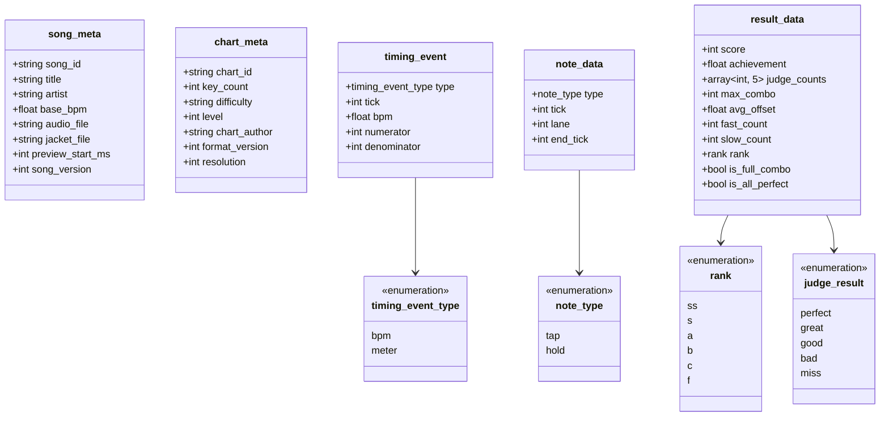
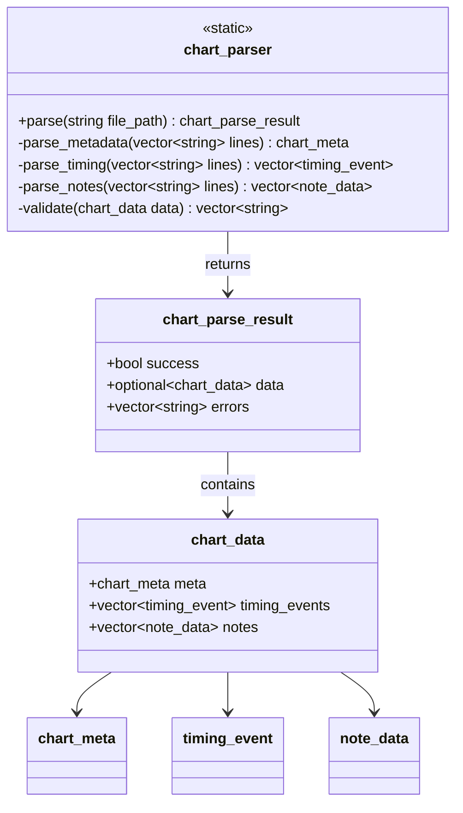
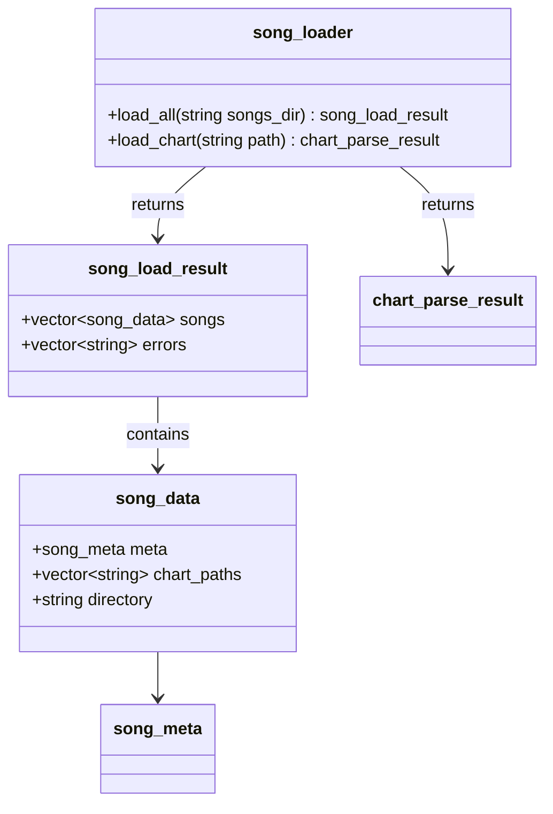

# クラス図

## Phase 1-1: シーン管理システム

```mermaid
classDiagram
    class scene {
        <<abstract>>
        #scene_manager& manager_
        +update(float dt) void*
        +draw() void*
        +on_enter() void
        +on_exit() void
    }

    class scene_manager {
        -unique_ptr~scene~ current_scene_
        -unique_ptr~scene~ next_scene_
        +update(float dt) void
        +draw() void
        +change_scene(unique_ptr~scene~) void
    }

    class title_scene {
        +update(float dt) void
        +draw() void
        +on_enter() void
        +on_exit() void
    }

    class song_select_scene {
        +update(float dt) void
        +draw() void
        +on_enter() void
        +on_exit() void
    }

    class play_scene {
        +update(float dt) void
        +draw() void
        +on_enter() void
        +on_exit() void
    }

    class result_scene {
        +update(float dt) void
        +draw() void
        +on_enter() void
        +on_exit() void
    }

    class settings_scene {
        +update(float dt) void
        +draw() void
        +on_enter() void
        +on_exit() void
    }

    scene_manager o-- scene : manages
    scene --> scene_manager : requests transition

    scene <|-- title_scene
    scene <|-- song_select_scene
    scene <|-- play_scene
    scene <|-- result_scene
    scene <|-- settings_scene
```

## Phase 1-2: データモデル

```mermaid
classDiagram
    class song_meta {
        +string song_id
        +string title
        +string artist
        +float base_bpm
        +string audio_file
        +string jacket_file
        +int preview_start_ms
        +int song_version
    }

    class chart_meta {
        +string chart_id
        +int key_count
        +string difficulty
        +int level
        +string chart_author
        +int format_version
        +int resolution
    }

    class timing_event_type {
        <<enumeration>>
        bpm
        meter
    }

    class timing_event {
        +timing_event_type type
        +int tick
        +float bpm
        +int numerator
        +int denominator
    }

    class note_type {
        <<enumeration>>
        tap
        hold
    }

    class note_data {
        +note_type type
        +int tick
        +int lane
        +int end_tick
    }

    class judge_result {
        <<enumeration>>
        perfect
        great
        good
        bad
        miss
    }

    class rank {
        <<enumeration>>
        ss
        s
        a
        b
        c
        f
    }

    class result_data {
        +int score
        +float achievement
        +array~int, 5~ judge_counts
        +int max_combo
        +float avg_offset
        +int fast_count
        +int slow_count
        +rank rank
        +bool is_full_combo
        +bool is_all_perfect
    }

    timing_event --> timing_event_type
    note_data --> note_type
    result_data --> rank
    result_data --> judge_result
```

## Phase 2-1: 譜面パーサー

```mermaid
classDiagram
    class chart_parser {
        <<static>>
        +parse(string file_path) chart_parse_result
        -parse_metadata(vector~string~ lines) chart_meta
        -parse_timing(vector~string~ lines) vector~timing_event~
        -parse_notes(vector~string~ lines) vector~note_data~
        -validate(chart_data data) vector~string~
    }

    class chart_data {
        +chart_meta meta
        +vector~timing_event~ timing_events
        +vector~note_data~ notes
    }

    class chart_parse_result {
        +bool success
        +optional~chart_data~ data
        +vector~string~ errors
    }

    chart_parser --> chart_parse_result : returns
    chart_parse_result --> chart_data : contains
    chart_data --> chart_meta
    chart_data --> timing_event
    chart_data --> note_data
```

## Phase 2-2: 楽曲ローダー

```mermaid
classDiagram
    class song_loader {
        +load_all(string songs_dir) song_load_result
        +load_chart(string path) chart_parse_result
    }

    class song_data {
        +song_meta meta
        +vector~string~ chart_paths
        +string directory
    }

    class song_load_result {
        +vector~song_data~ songs
        +vector~string~ errors
    }

    song_loader --> song_load_result : returns
    song_loader --> chart_parse_result : returns
    song_load_result --> song_data : contains
    song_data --> song_meta
```
