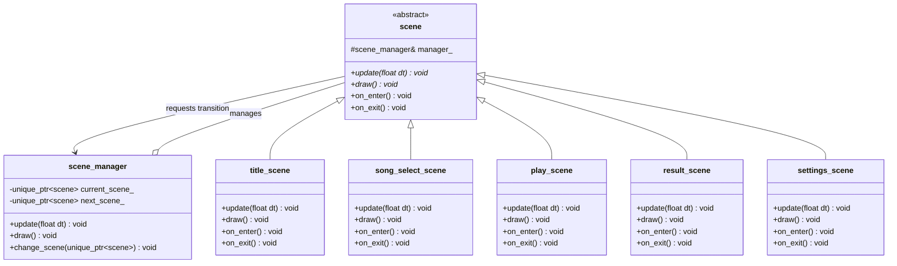
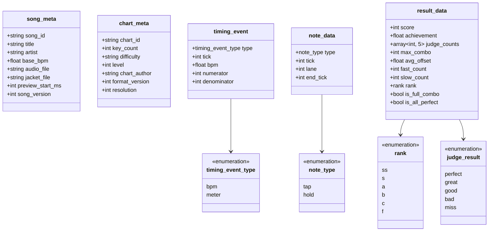
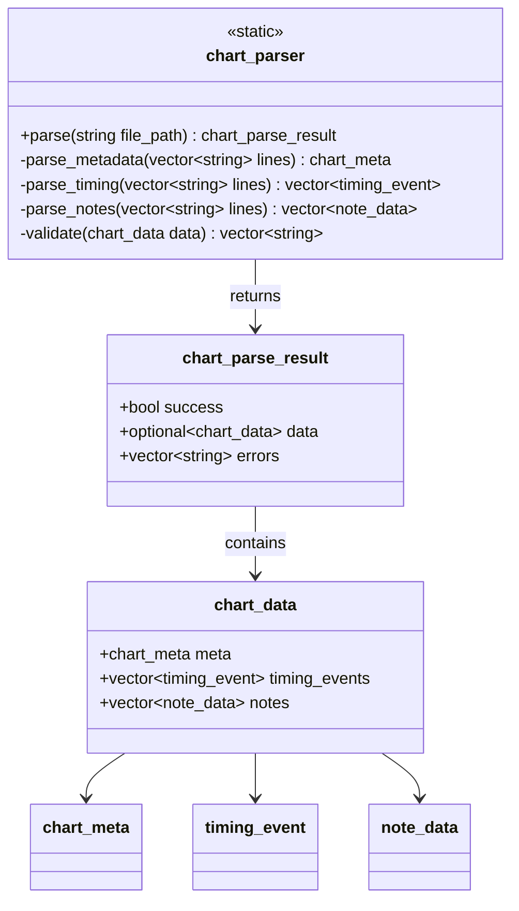
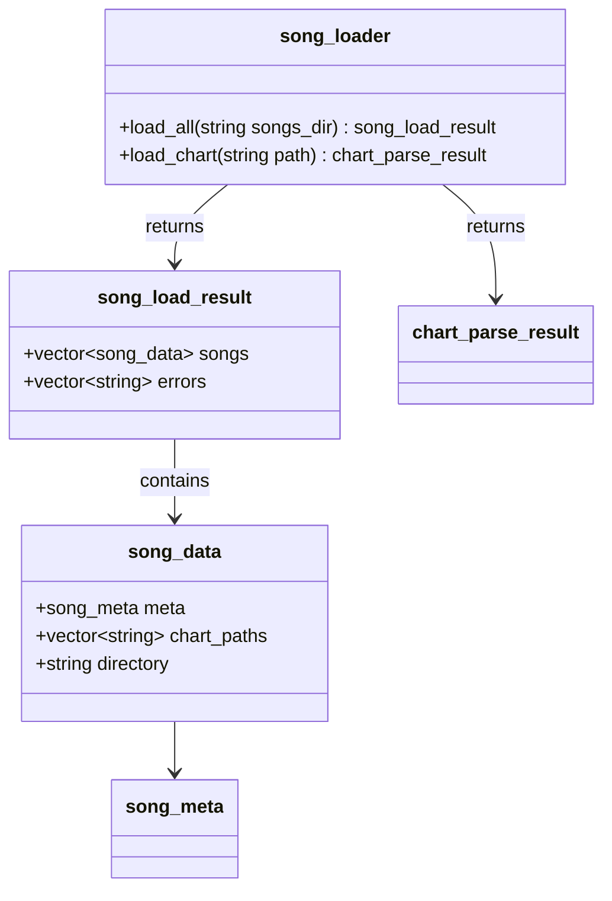
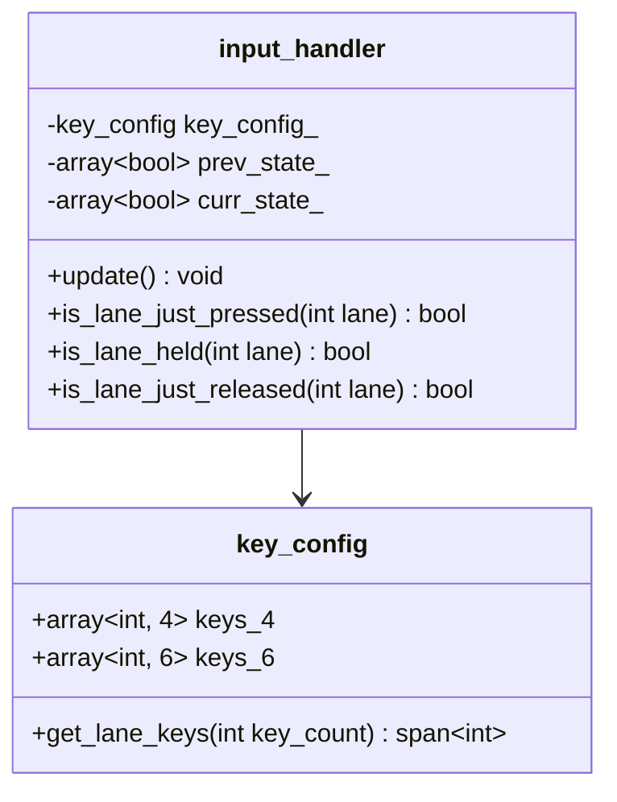
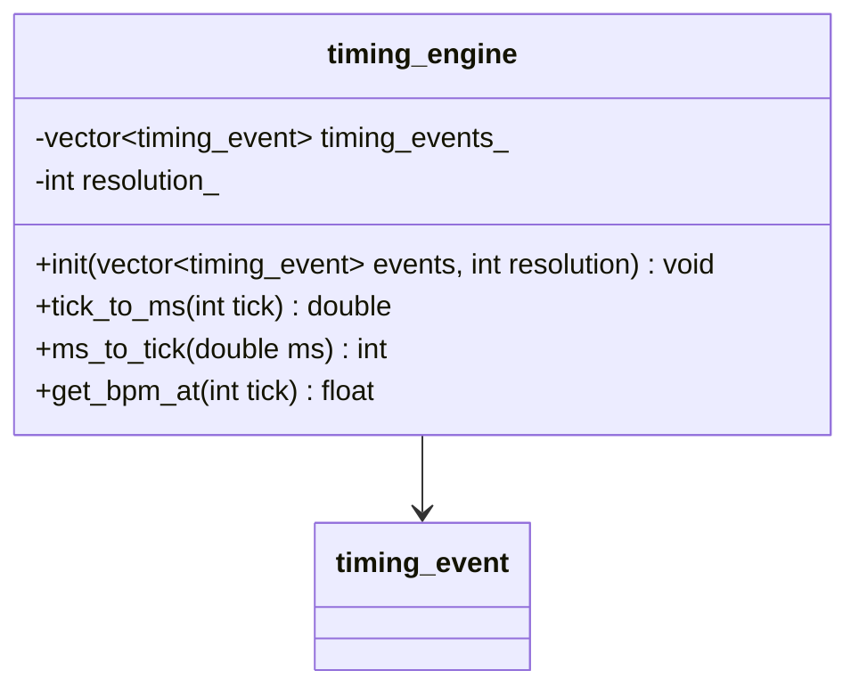
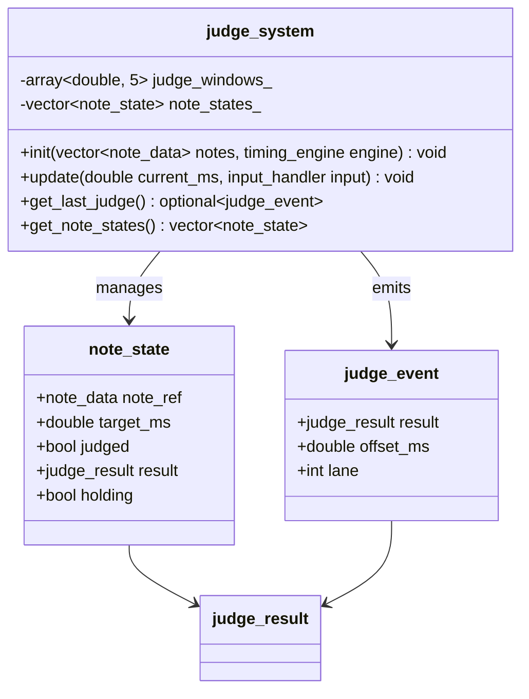
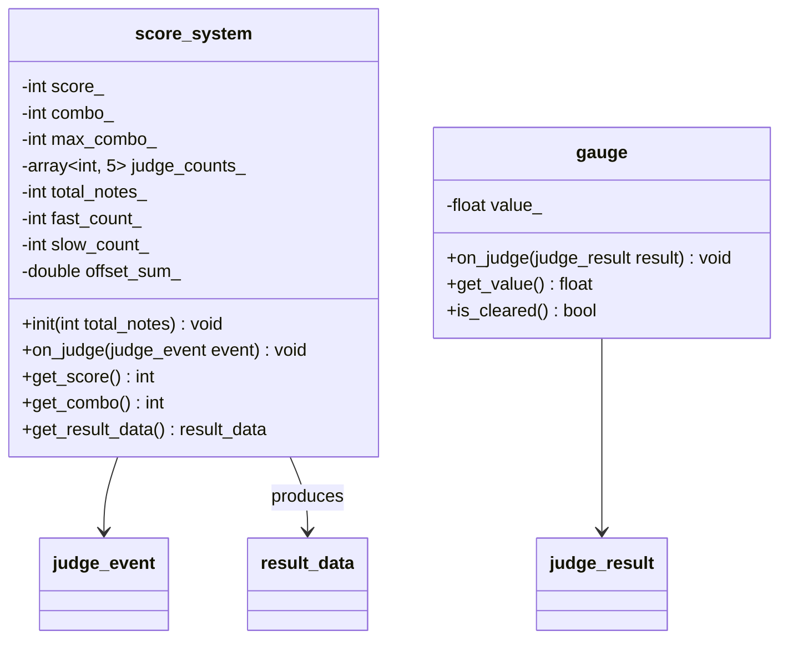

# クラス図

## Phase 1-1: シーン管理システム

## Phase 1-2: データモデル

## Phase 2-1: 譜面パーサー

## Phase 2-2: 楽曲ローダー

## Phase 3-1: 入力ハンドラー

## Phase 3-2: タイミングエンジン

## Phase 3-3: 判定システム

## Phase 3-4: スコア・ゲージ

